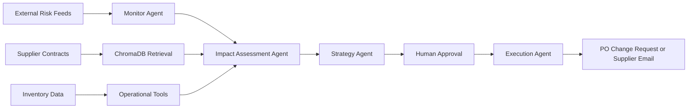

# Architecture

## System Overview

The Cross-Functional Supply Chain Concierge is planned as an agentic workflow that connects supplier risk signals, retrieval over supplier documents, and internal operational data.

## Initial Components

- **Backend API:** FastAPI service for health checks and future workflow endpoints.
- **Agent Layer:** Planned LangGraph nodes for monitoring, impact assessment, strategy, approval, and execution.
- **Retrieval Layer:** Planned ChromaDB vector store for supplier contracts and logistics documents.
- **Tool Layer:** Planned inventory, supplier, purchase order, and material lookup tools.
- **Frontend:** Placeholder operations dashboard that will become the approval and monitoring console.

## Stage 1 Boundary

Stage 1 does not implement autonomous decision-making yet. It creates the repository foundation needed to add mock data, retrieval, tools, and LangGraph orchestration in later stages.
